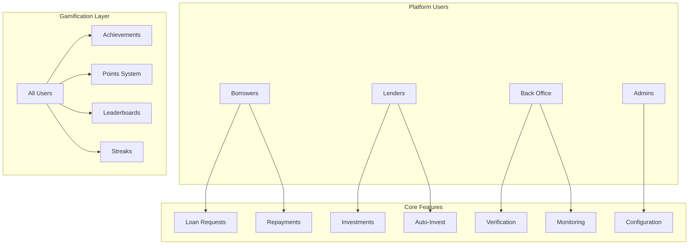
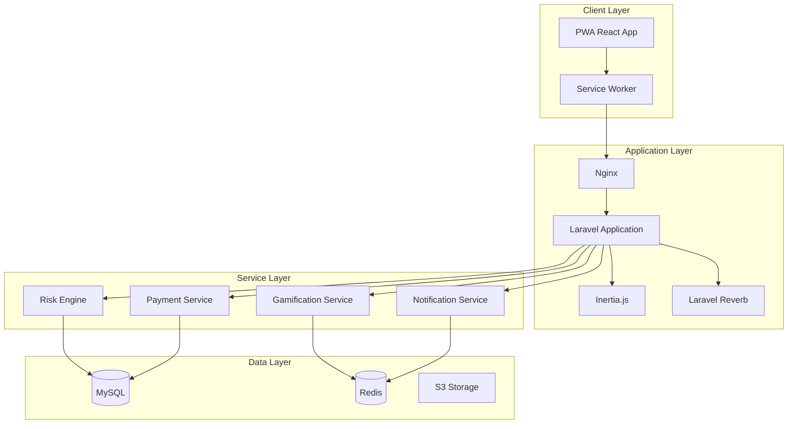
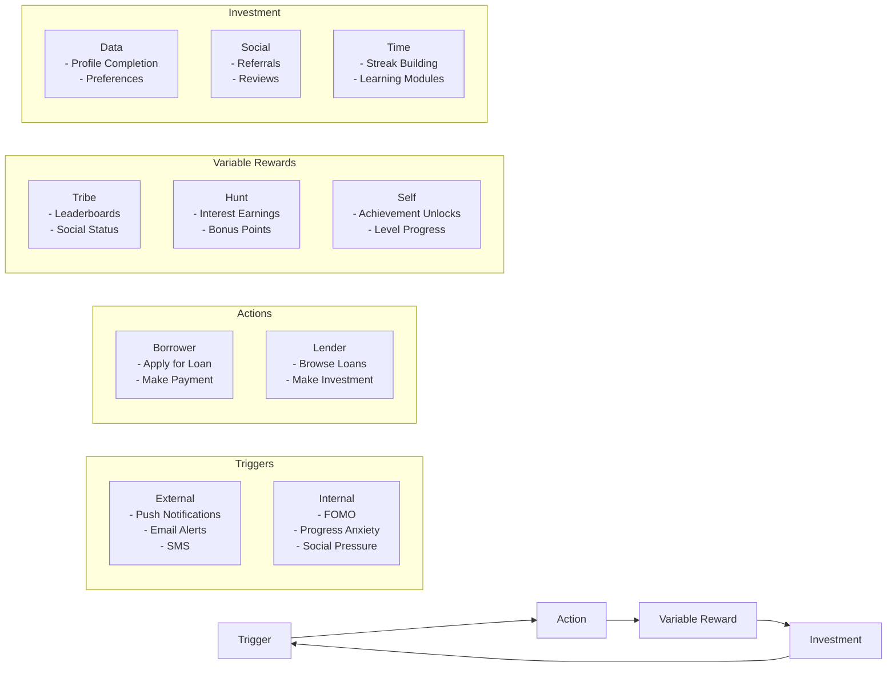
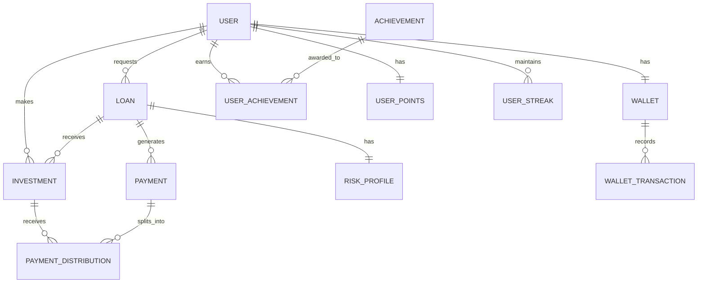
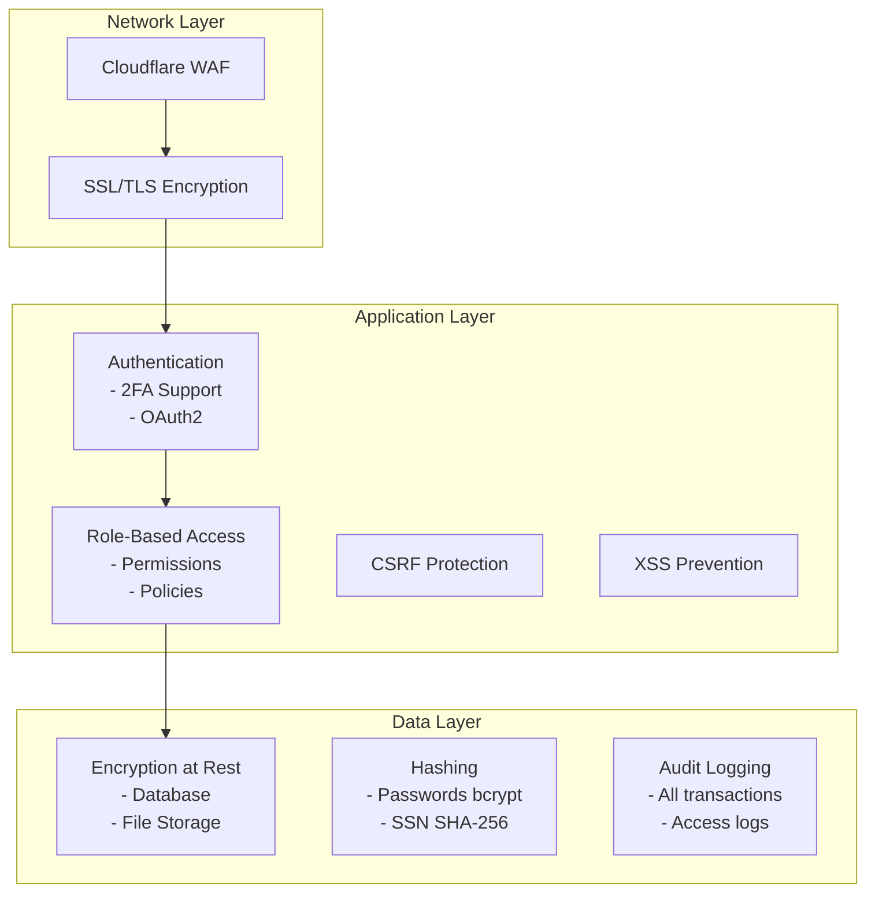
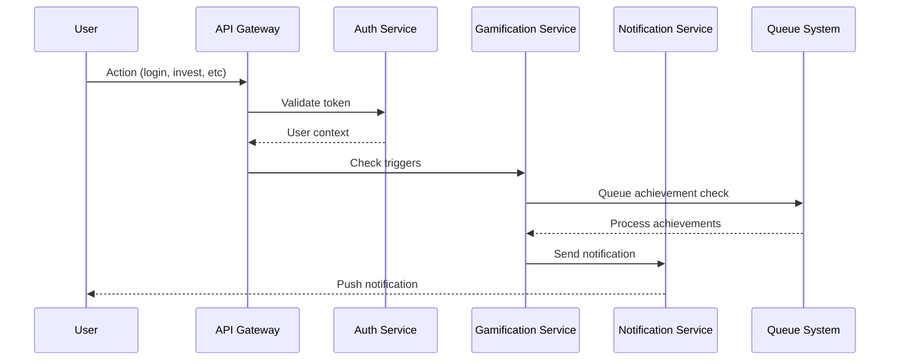
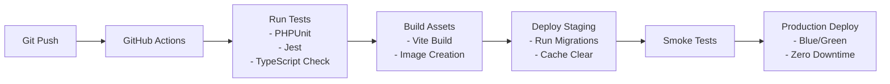
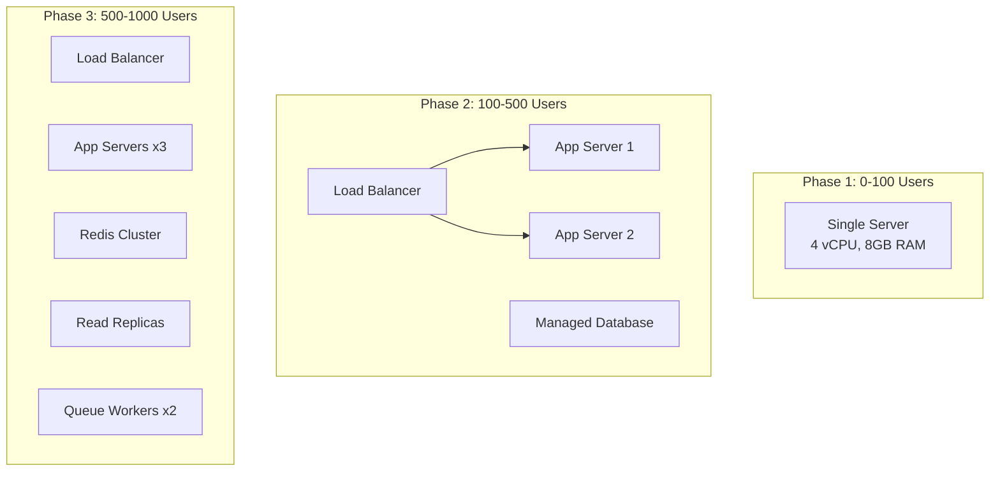
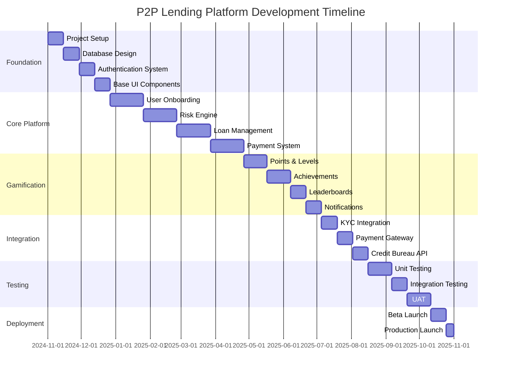

# P2P Lending Platform - Technical Architecture Document

**Version:** 1.0  
**Date:** November 2024  
**Status:** Draft for Review  
**Author:** Technical Lead  

---

## Table of Contents

1. [Executive Summary](#1-executive-summary)
2. [System Overview](#2-system-overview)
3. [Technical Architecture](#3-technical-architecture)
4. [Gamification Architecture](#4-gamification-architecture)
5. [Data Architecture](#5-data-architecture)
6. [Security Architecture](#6-security-architecture)
7. [Integration Architecture](#7-integration-architecture)
8. [Infrastructure & Deployment](#8-infrastructure--deployment)
9. [Development Methodology](#9-development-methodology)
10. [Performance & Scalability](#10-performance--scalability)
11. [Risk Analysis & Mitigation](#11-risk-analysis--mitigation)
12. [Success Metrics & KPIs](#12-success-metrics--kpis)
13. [Implementation Timeline](#13-implementation-timeline)
14. [Appendices](#14-appendices)

---

## 1. Executive Summary

### 1.1 Project Overview

The P2P Lending Platform is a Progressive Web Application (PWA) designed to facilitate peer-to-peer lending in the Caribbean market. The platform incorporates advanced gamification mechanics based on Nir Eyal's Hook Model to drive user engagement and retention.

### 1.2 Key Business Objectives

- **Primary Goal:** Create a habit-forming P2P lending platform that connects borrowers and lenders efficiently
- **Target Market:** Caribbean region, initial scale of 100 users, scalable to 1,000 concurrent loan requests
- **Differentiation:** Gamification-driven engagement with proprietary risk scoring
- **Timeline:** 12-month development cycle to production

### 1.3 Technical Highlights

- **Architecture:** Monolithic Laravel application with React frontend via Inertia.js
- **Platform Strategy:** PWA-first approach for cross-platform compatibility
- **Real-time Features:** WebSocket-based auction system using Laravel Reverb
- **Gamification:** Comprehensive achievement, points, and leaderboard systems
- **Security:** Multi-layered security with RBAC, KYC/AML compliance

### 1.4 Investment Requirements

- **Development Time:** 12 months (solo developer)
- **Infrastructure Cost:** ~$500-1,000/month at launch
- **Third-party Services:** Credit bureau API, KYC provider, payment gateway

---

## 2. System Overview

### 2.1 User Personas



### 2.2 Core Business Processes

| Process | Description | SLA |
|---------|------------|-----|
| **Borrower Onboarding** | KYC verification, credit check, risk assessment | 24-48 hours |
| **Loan Funding** | 15-day auction window, minimum 100% funding required | 15 days max |
| **Payment Processing** | Manual verification → automated distribution | 24 hours |
| **Withdrawal Processing** | Lender withdrawal from wallet to bank | 48-72 hours |
| **Default Management** | Collections workflow, write-off procedures | 90-day cycle |

### 2.3 System Characteristics

- **Availability:** 99.9% uptime target
- **Performance:** <200ms API response time
- **Scalability:** 1,000 concurrent users, 100 TPS
- **Compliance:** KYC/AML regulations for Caribbean region
- **Data Retention:** 7 years for financial records

---

## 3. Technical Architecture

### 3.1 Technology Stack

```yaml
Frontend:
  - Framework: React 18 with TypeScript
  - State Management: Inertia.js (server-driven)
  - Build Tool: Vite 5
  - CSS Framework: Tailwind CSS 3
  - Animation: Framer Motion
  - PWA: vite-plugin-pwa

Backend:
  - Framework: Laravel 11
  - Language: PHP 8.2+
  - Queue System: Redis + Laravel Horizon
  - WebSockets: Laravel Reverb
  - Cache: Redis

Database:
  - Primary: MySQL 8.0
  - Cache: Redis 7.0
  - File Storage: S3-compatible (local/AWS)

Infrastructure:
  - Web Server: Nginx
  - Process Manager: Supervisor
  - Monitoring: Laravel Telescope (dev), Sentry (prod)
  - Analytics: Metabase
```

### 3.2 Application Architecture



### 3.3 Component Architecture

```typescript
// Domain Structure
src/
├── Domain/
│   ├── User/
│   │   ├── Models/
│   │   ├── Services/
│   │   ├── Repositories/
│   │   └── Events/
│   ├── Lending/
│   │   ├── Models/
│   │   ├── Services/
│   │   ├── Calculators/
│   │   └── Validators/
│   ├── Gamification/
│   │   ├── Models/
│   │   ├── Services/
│   │   ├── Achievements/
│   │   └── Leaderboards/
│   └── Payment/
│       ├── Models/
│       ├── Services/
│       ├── Gateways/
│       └── Processors/
```

---

## 4. Gamification Architecture

### 4.1 Hook Model Implementation



### 4.2 Gamification Components

#### 4.2.1 Points System

```typescript
interface PointsStructure {
    actions: {
        login_daily: 5,
        complete_profile: 50,
        first_loan: 100,
        first_investment: 100,
        successful_repayment: 20,
        refer_friend: 50,
        achieve_milestone: 25-500
    },
    multipliers: {
        streak_7_days: 1.2,
        streak_30_days: 1.5,
        vip_status: 2.0,
        special_events: 2.5
    },
    levels: {
        1: 0,
        2: 100,
        3: 300,
        4: 600,
        5: 1000,
        6: 1500,
        7: 2500,
        8: 4000,
        9: 6000,
        10: 10000
    }
}
```

#### 4.2.2 Achievement Categories

| Category | Count | Example Achievements | Points Range |
|----------|-------|---------------------|--------------|
| **Onboarding** | 5 | Profile Complete, First Login, KYC Verified | 10-100 |
| **Borrower** | 15 | First Loan, Perfect Repayment, Credit Climber | 25-500 |
| **Lender** | 15 | Portfolio Diversity, Risk Master, Profit Maker | 25-500 |
| **Social** | 10 | Community Helper, Referral King, Reviewer | 20-200 |
| **Learning** | 8 | Finance Scholar, Risk Expert, Module Master | 15-150 |
| **Special** | 5 | Anniversary, Holiday Events, Beta Tester | 50-1000 |

#### 4.2.3 Leaderboard Types

```yaml
Leaderboards:
  Global:
    - Top Investors (by volume)
    - Most Reliable Borrowers (by repayment)
    - Achievement Hunters (by points)
    - Streak Warriors (by consecutive days)
  
  Segmented:
    - Risk Grade Leagues (A+, A, B, C, D, E)
    - Monthly Competitions
    - Regional Rankings
    - New User Rankings (first 30 days)
```

### 4.3 Notification Strategy

```typescript
interface NotificationTriggers {
    immediate: [
        'achievement_unlocked',
        'loan_funded',
        'payment_received',
        'level_up'
    ],
    scheduled: [
        'streak_reminder',     // 9 AM daily
        'funding_deadline',     // 48h before close
        'payment_reminder',     // 3 days before due
        'weekly_summary'        // Monday 10 AM
    ],
    behavioral: [
        'abandonment_recovery', // 3 days inactive
        'milestone_near',       // 90% to achievement
        'investment_match',     // Real-time opportunity
        'social_activity'       // Friend achievements
    ]
}
```

---

## 5. Data Architecture

### 5.1 Entity Relationship Diagram



### 5.2 Core Database Schema

```sql
-- Users and Authentication
CREATE TABLE users (
    id BIGINT PRIMARY KEY AUTO_INCREMENT,
    email VARCHAR(255) UNIQUE NOT NULL,
    password VARCHAR(255) NOT NULL,
    type ENUM('borrower', 'lender', 'backoffice', 'admin'),
    status ENUM('pending', 'active', 'suspended', 'blocked'),
    kyc_status ENUM('pending', 'verified', 'rejected'),
    email_verified_at TIMESTAMP NULL,
    created_at TIMESTAMP DEFAULT CURRENT_TIMESTAMP,
    updated_at TIMESTAMP DEFAULT CURRENT_TIMESTAMP ON UPDATE CURRENT_TIMESTAMP,
    INDEX idx_type_status (type, status),
    INDEX idx_kyc_status (kyc_status)
) ENGINE=InnoDB;

-- Risk Profiles
CREATE TABLE risk_profiles (
    id BIGINT PRIMARY KEY AUTO_INCREMENT,
    user_id BIGINT NOT NULL,
    risk_grade ENUM('A+', 'A', 'B', 'C', 'D', 'E'),
    risk_score INT NOT NULL,
    credit_score INT,
    debt_to_income DECIMAL(5,2),
    employment_stability INT,
    factors JSON,
    calculated_at TIMESTAMP DEFAULT CURRENT_TIMESTAMP,
    INDEX idx_user_grade (user_id, risk_grade),
    FOREIGN KEY (user_id) REFERENCES users(id) ON DELETE CASCADE
) ENGINE=InnoDB;

-- Loans
CREATE TABLE loans (
    id BIGINT PRIMARY KEY AUTO_INCREMENT,
    borrower_id BIGINT NOT NULL,
    amount DECIMAL(10,2) NOT NULL,
    term_months INT NOT NULL,
    interest_rate DECIMAL(5,2) NOT NULL,
    risk_grade ENUM('A+', 'A', 'B', 'C', 'D', 'E'),
    purpose VARCHAR(255),
    status ENUM('draft', 'submitted', 'under_review', 'approved', 
                'funding', 'funded', 'active', 'completed', 'defaulted'),
    funding_deadline TIMESTAMP NULL,
    funding_percentage DECIMAL(5,2) DEFAULT 0,
    created_at TIMESTAMP DEFAULT CURRENT_TIMESTAMP,
    updated_at TIMESTAMP DEFAULT CURRENT_TIMESTAMP ON UPDATE CURRENT_TIMESTAMP,
    INDEX idx_status_deadline (status, funding_deadline),
    INDEX idx_borrower_status (borrower_id, status),
    FOREIGN KEY (borrower_id) REFERENCES users(id)
) ENGINE=InnoDB;

-- Gamification Tables
CREATE TABLE user_points (
    id BIGINT PRIMARY KEY AUTO_INCREMENT,
    user_id BIGINT NOT NULL UNIQUE,
    points_balance INT DEFAULT 0,
    lifetime_points INT DEFAULT 0,
    level INT DEFAULT 1,
    level_progress INT DEFAULT 0,
    created_at TIMESTAMP DEFAULT CURRENT_TIMESTAMP,
    updated_at TIMESTAMP DEFAULT CURRENT_TIMESTAMP ON UPDATE CURRENT_TIMESTAMP,
    INDEX idx_level_points (level, lifetime_points),
    FOREIGN KEY (user_id) REFERENCES users(id) ON DELETE CASCADE
) ENGINE=InnoDB;
```

### 5.3 Data Retention Policy

| Data Type | Retention Period | Archive Strategy |
|-----------|-----------------|------------------|
| Financial Transactions | 7 years | Cold storage after 2 years |
| User Profiles | Account lifetime + 1 year | Soft delete |
| Loan Documents | 7 years | S3 Glacier after completion |
| Activity Logs | 90 days | Aggregate metrics only |
| Gamification Data | Account lifetime | No archive |

---

## 6. Security Architecture

### 6.1 Security Layers



### 6.2 RBAC Permission Matrix

```typescript
interface PermissionMatrix {
    borrower: [
        'loans.create',
        'loans.view.own',
        'payments.make',
        'profile.update.own',
        'documents.upload.own'
    ],
    lender: [
        'loans.view.all',
        'investments.create',
        'investments.view.own',
        'wallet.manage.own',
        'autoinvest.configure'
    ],
    backoffice: [
        'users.verify',
        'loans.review',
        'payments.verify',
        'documents.review',
        'reports.view.basic'
    ],
    admin: [
        'system.configure',
        'users.manage.all',
        'reports.view.all',
        'audit.view.all',
        'settings.modify'
    ]
}
```

### 6.3 Compliance Requirements

| Requirement | Implementation | Validation |
|-------------|---------------|------------|
| **KYC Verification** | Third-party API integration | Government ID + Selfie |
| **AML Monitoring** | Transaction pattern analysis | Daily automated checks |
| **Data Privacy** | GDPR-compliant practices | User consent, data portability |
| **PCI Compliance** | No card storage, tokenization | External payment gateway |
| **Audit Trail** | Immutable logs | Blockchain consideration |

---

## 7. Integration Architecture

### 7.1 External Integrations

```yaml
Credit Bureau API:
  Provider: Regional Credit Bureau
  Protocol: REST API with OAuth2
  Frequency: On-demand during onboarding
  SLA: 99.5% availability, <3s response

KYC Provider:
  Provider: Jumio/Onfido or similar
  Protocol: REST API + Webhooks
  Data: Document verification, liveness check
  SLA: 99.9% availability

Payment Gateway:
  Provider: Regional processor
  Protocol: REST API with webhook callbacks
  Features: Tokenization, recurring payments
  Settlement: T+2 business days

Banking APIs:
  Provider: Open Banking APIs
  Protocol: OAuth2 + REST
  Features: Account verification, balance check
  Coverage: Major Caribbean banks
```

### 7.2 Internal Service Communication



---

## 8. Infrastructure & Deployment

### 8.1 Deployment Architecture

```yaml
Development:
  Environment: Local Docker
  Services:
    - Laravel Sail
    - MySQL 8.0
    - Redis
    - Mailhog
    - MinIO (S3 compatible)

Staging:
  Environment: Cloud VPS
  Specs: 4 vCPU, 8GB RAM
  Services:
    - Same as production
    - Lower resources
    - Test data only

Production:
  Environment: AWS/DigitalOcean
  Architecture:
    - Load Balancer (2x servers)
    - Application Servers (2x 8vCPU, 16GB RAM)
    - Database (RDS/Managed MySQL)
    - Redis Cluster (Elasticache/Managed)
    - CDN (CloudFlare)
    - File Storage (S3)
```

### 8.2 CI/CD Pipeline



### 8.3 Monitoring Stack

```yaml
Application Monitoring:
  - Laravel Telescope (Development)
  - Sentry (Error tracking)
  - New Relic APM (Performance)

Infrastructure Monitoring:
  - Prometheus + Grafana
  - Uptime monitoring (Pingdom)
  - Log aggregation (ELK Stack)

Business Metrics:
  - Metabase (Analytics)
  - Custom dashboards
  - Daily email reports
```

---

## 9. Development Methodology

### 9.1 TDD Approach

```php
// Example Test Structure
class LoanFundingTest extends TestCase
{
    /** @test */
    public function loan_cannot_be_funded_beyond_required_amount()
    {
        // Arrange
        $loan = Loan::factory()->create(['amount' => 1000]);
        $lender1 = User::factory()->lender()->create();
        $lender2 = User::factory()->lender()->create();
        
        // Act
        $loan->fund($lender1, 800);
        $result = $loan->fund($lender2, 300); // Exceeds by 100
        
        // Assert
        $this->assertFalse($result->success);
        $this->assertEquals(200, $result->allowed_amount);
        $this->assertEquals(80, $loan->funding_percentage);
    }
}
```

### 9.2 Development Workflow

1. **Feature Planning**
   - User story creation
   - Technical design review
   - Test case definition

2. **Implementation**
   - Write failing tests
   - Implement minimum code
   - Refactor for quality

3. **Review Process**
   - Code review checklist
   - Security review
   - Performance testing

4. **Deployment**
   - Feature flag deployment
   - Gradual rollout
   - Monitoring & rollback plan

---

## 10. Performance & Scalability

### 10.1 Performance Targets

| Metric | Target | Current | Strategy |
|--------|--------|---------|----------|
| **Page Load Time** | <2s | N/A | PWA caching, CDN |
| **API Response** | <200ms | N/A | Redis caching |
| **WebSocket Latency** | <100ms | N/A | Regional servers |
| **Database Queries** | <50ms | N/A | Query optimization |
| **Concurrent Users** | 1,000 | 100 | Horizontal scaling |

### 10.2 Caching Strategy

```php
// Multi-layer caching approach
class CacheStrategy {
    const CACHE_TIMES = [
        'user_profile' => 3600,        // 1 hour
        'risk_score' => 86400,         // 24 hours  
        'loan_list' => 300,            // 5 minutes
        'leaderboard' => 900,          // 15 minutes
        'achievements' => 7200,        // 2 hours
        'static_content' => 604800     // 1 week
    ];
}
```

### 10.3 Scaling Plan



---

## 11. Risk Analysis & Mitigation

### 11.1 Technical Risks

| Risk | Probability | Impact | Mitigation |
|------|------------|--------|------------|
| **Data Breach** | Medium | Critical | Encryption, security audits, penetration testing |
| **System Downtime** | Low | High | HA architecture, automated failover, backups |
| **Scaling Issues** | Medium | Medium | Load testing, gradual rollout, monitoring |
| **Integration Failure** | Medium | High | Circuit breakers, fallback mechanisms |
| **Tech Debt** | High | Medium | Regular refactoring sprints, code reviews |

### 11.2 Business Risks

| Risk | Probability | Impact | Mitigation |
|------|------------|--------|------------|
| **Low User Adoption** | Medium | Critical | Gamification, marketing, referral program |
| **High Default Rate** | Medium | High | Robust risk scoring, collection process |
| **Regulatory Changes** | Low | High | Legal compliance review, adaptable architecture |
| **Competition** | High | Medium | Unique features, superior UX, community building |

### 11.3 Contingency Plans

```yaml
Disaster Recovery:
  RTO: 4 hours
  RPO: 1 hour
  Backup: Daily automated, tested monthly
  Failover: Automated DNS switching

Data Loss:
  Database: Point-in-time recovery
  Files: S3 versioning
  Code: Git repository

Security Incident:
  Response Team: On-call rotation
  Procedure: Documented runbooks
  Communication: Pre-drafted templates
```

---

## 12. Success Metrics & KPIs

### 12.1 Technical KPIs

```typescript
interface TechnicalKPIs {
    reliability: {
        uptime: '99.9%',
        error_rate: '<0.1%',
        mttr: '<30 minutes'
    },
    performance: {
        apdex_score: '>0.9',
        page_load: '<2 seconds',
        api_response: '<200ms'
    },
    quality: {
        test_coverage: '>80%',
        technical_debt_ratio: '<5%',
        deployment_frequency: 'weekly'
    }
}
```

### 12.2 Business KPIs

```typescript
interface BusinessKPIs {
    user_metrics: {
        monthly_active_users: number,
        user_retention_day30: '>40%',
        nps_score: '>50'
    },
    financial_metrics: {
        total_loan_volume: number,
        default_rate: '<5%',
        average_roi_lenders: '>8%'
    },
    gamification_metrics: {
        daily_active_users: number,
        avg_session_duration: '>10 minutes',
        achievement_completion_rate: '>30%',
        streak_retention: '>25%'
    }
}
```

### 12.3 Monitoring Dashboard

```yaml
Executive Dashboard:
  - Total users (growth %)
  - Active loans
  - Platform revenue
  - System health

Operational Dashboard:
  - Real-time transactions
  - Queue depth
  - Error rates
  - API performance

Gamification Dashboard:
  - Daily active users
  - Achievement unlocks/hour
  - Leaderboard changes
  - Notification delivery rate
```

---

## 13. Implementation Timeline

### 13.1 Development Phases



### 13.2 Milestone Schedule

| Milestone | Target Date | Deliverables |
|-----------|------------|--------------|
| **M1: Foundation Complete** | Month 3 | Basic platform, authentication, database |
| **M2: MVP Features** | Month 6 | Loan cycle, basic gamification |
| **M3: Full Gamification** | Month 9 | All game mechanics, achievements |
| **M4: Beta Launch** | Month 10 | Limited user testing |
| **M5: Production Launch** | Month 12 | Full platform launch |

### 13.3 Resource Requirements

```yaml
Development Team:
  - Lead Developer: 1 FTE (12 months)
  - UI/UX Designer: 0.25 FTE (contracted)
  - QA Tester: 0.25 FTE (months 9-12)

Infrastructure Budget:
  - Development: $100/month
  - Staging: $200/month
  - Production: $500-1000/month (scaling)
  
Third-party Services:
  - KYC Provider: $1-3 per verification
  - Credit Bureau: $2-5 per check
  - Payment Gateway: 2.9% + $0.30 per transaction
  - Monitoring Tools: $200/month
```

---

## 14. Appendices

### Appendix A: API Documentation Structure

```yaml
API Documentation:
  - Authentication Endpoints
  - User Management
  - Loan Operations
  - Investment Management
  - Gamification Endpoints
  - Webhook Specifications
  - Error Codes
  - Rate Limiting
```

### Appendix B: Database Indexes

```sql
-- Performance-critical indexes
CREATE INDEX idx_loans_funding ON loans(status, funding_deadline) 
  WHERE status = 'funding';

CREATE INDEX idx_investments_active ON investments(lender_id, status) 
  WHERE status = 'active';

CREATE INDEX idx_achievements_pending ON user_achievements(user_id, notified_at) 
  WHERE completed_at IS NOT NULL AND notified_at IS NULL;

CREATE INDEX idx_notifications_unsent ON gamification_notifications(user_id, status) 
  WHERE status = 'pending';
```

### Appendix C: Compliance Checklist

- [ ] KYC/AML procedures documented
- [ ] Data privacy policy implemented
- [ ] Terms of service reviewed by legal
- [ ] Financial regulations compliance
- [ ] Security audit completed
- [ ] Penetration testing performed
- [ ] Disaster recovery plan tested
- [ ] GDPR compliance verified

### Appendix D: Technology Decision Record

| Decision | Choice | Rationale |
|----------|--------|-----------|
| **Frontend Framework** | React + TypeScript | Type safety, component reusability, large ecosystem |
| **Backend Framework** | Laravel | Rapid development, built-in features, strong security |
| **PWA vs Native** | PWA | Single codebase, lower maintenance, faster deployment |
| **Database** | MySQL | ACID compliance, proven reliability, strong Laravel support |
| **Real-time** | Laravel Reverb | Native Laravel integration, cost-effective |
| **Deployment** | Cloud VPS | Cost control, flexibility, regional presence |

---

## Document Approval

| Role | Name | Date | Signature |
|------|------|------|-----------|
| Technical Lead | | | |
| Product Owner | | | |
| Security Officer | | | |
| Compliance Officer | | | |

---

## Revision History

| Version | Date | Author | Changes |
|---------|------|--------|---------|
| 1.0 | Nov 2024 | Technical Lead | Initial draft |

---

## Contact Information

**Technical Questions:**  
Email: tech@p2plending.com  

**Business Questions:**  
Email: business@p2plending.com  

**Security Issues:**  
Email: security@p2plending.com

---

*This document is confidential and proprietary. Distribution is limited to authorized personnel only.*
