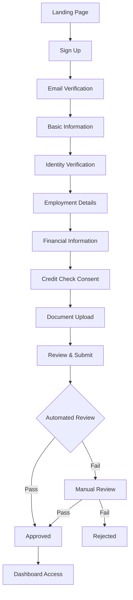
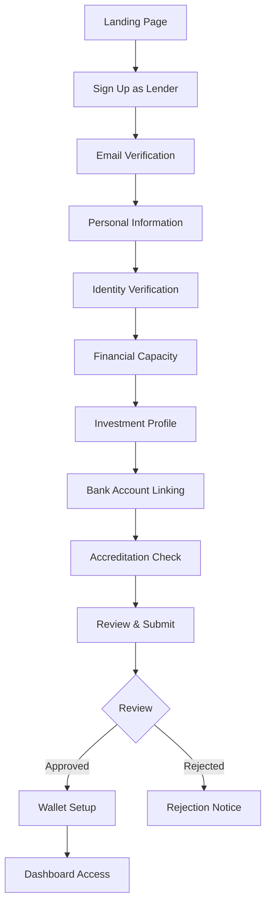

# User Onboarding Workflows Documentation

## Executive Summary

This document outlines the complete user onboarding workflows for the LoanWealth P2P lending platform, covering all user personas (Borrowers, Lenders, Back Office, Admins) with detailed technical implementation, UI/UX considerations, and compliance requirements.

---

## Table of Contents

1. [Onboarding Overview](#onboarding-overview)
2. [Borrower Onboarding Workflow](#borrower-onboarding-workflow)
3. [Lender Onboarding Workflow](#lender-onboarding-workflow)
4. [Back Office & Admin Onboarding](#back-office--admin-onboarding)
5. [KYC/AML Verification Process](#kycaml-verification-process)
6. [Technical Implementation](#technical-implementation)
7. [UI/UX Components](#uiux-components)
8. [Error Handling & Recovery](#error-handling--recovery)
9. [Monitoring & Analytics](#monitoring--analytics)

---

## Onboarding Overview

### Design Principles

1. **Progressive Disclosure**: Collect information gradually to reduce cognitive load
2. **Trust Building**: Show security badges, testimonials, and compliance information
3. **Mobile-First**: Optimize for mobile devices with camera document capture
4. **Accessibility**: WCAG 2.1 AA compliance for all onboarding flows
5. **Error Recovery**: Save progress automatically, allow users to resume later
6. **Transparency**: Clear explanation of why each piece of information is needed

### Onboarding States

```typescript
enum OnboardingStatus {
  NOT_STARTED = 'not_started',
  BASIC_INFO = 'basic_info',
  IDENTITY_VERIFICATION = 'identity_verification',
  FINANCIAL_PROFILE = 'financial_profile',
  DOCUMENT_UPLOAD = 'document_upload',
  REVIEW = 'review',
  APPROVED = 'approved',
  REJECTED = 'rejected',
  SUSPENDED = 'suspended'
}
```

---

## Borrower Onboarding Workflow

### High-Level Flow



### Step 1: Account Creation

```jsx
// resources/js/Pages/Onboarding/Borrower/AccountCreation.jsx

import React from 'react';
import { useForm } from '@inertiajs/react';
import { PasswordStrengthIndicator } from '@/Components/PasswordStrengthIndicator';
import { PhoneInput } from '@/Components/PhoneInput';

export default function AccountCreation() {
    const { data, setData, post, processing, errors } = useForm({
        email: '',
        password: '',
        password_confirmation: '',
        phone: '',
        phone_country_code: '+1',
        referral_code: '',
        terms_accepted: false,
        marketing_consent: false,
    });

    const handleSubmit = (e) => {
        e.preventDefault();
        post('/onboarding/borrower/account', {
            preserveScroll: true,
            onSuccess: () => {
                // Track conversion
                gtag('event', 'sign_up', {
                    method: 'email',
                    user_type: 'borrower'
                });
            }
        });
    };

    return (
        <OnboardingLayout
            step={1}
            totalSteps={8}
            title="Create Your Account"
            subtitle="Start your journey to financial freedom"
        >
            <form onSubmit={handleSubmit} className="space-y-6">
                <div>
                    <Label htmlFor="email">Email Address</Label>
                    <Input
                        id="email"
                        type="email"
                        value={data.email}
                        onChange={e => setData('email', e.target.value)}
                        error={errors.email}
                        placeholder="you@example.com"
                        autoComplete="email"
                        required
                    />
                    <ErrorMessage error={errors.email} />
                </div>

                <div>
                    <Label htmlFor="password">Password</Label>
                    <Input
                        id="password"
                        type="password"
                        value={data.password}
                        onChange={e => setData('password', e.target.value)}
                        error={errors.password}
                        required
                    />
                    <PasswordStrengthIndicator password={data.password} />
                    <ErrorMessage error={errors.password} />
                </div>

                <PhoneInput
                    value={data.phone}
                    countryCode={data.phone_country_code}
                    onChange={(phone, code) => {
                        setData({
                            ...data,
                            phone,
                            phone_country_code: code
                        });
                    }}
                    error={errors.phone}
                />

                <div>
                    <Label htmlFor="referral_code">Referral Code (Optional)</Label>
                    <Input
                        id="referral_code"
                        value={data.referral_code}
                        onChange={e => setData('referral_code', e.target.value)}
                        placeholder="Enter referral code"
                    />
                </div>

                <div className="space-y-3">
                    <Checkbox
                        id="terms"
                        checked={data.terms_accepted}
                        onChange={e => setData('terms_accepted', e.target.checked)}
                        required
                    >
                        I accept the{' '}
                        <Link href="/terms" target="_blank" className="underline">
                            Terms of Service
                        </Link>{' '}
                        and{' '}
                        <Link href="/privacy" target="_blank" className="underline">
                            Privacy Policy
                        </Link>
                    </Checkbox>

                    <Checkbox
                        id="marketing"
                        checked={data.marketing_consent}
                        onChange={e => setData('marketing_consent', e.target.checked)}
                    >
                        Send me tips and updates about LoanWealth products
                    </Checkbox>
                </div>

                <Button
                    type="submit"
                    className="w-full"
                    disabled={processing || !data.terms_accepted}
                >
                    {processing ? 'Creating Account...' : 'Create Account'}
                </Button>

                <SecurityBadges />
            </form>
        </OnboardingLayout>
    );
}
```

### Step 2: Email Verification

```php
// app/Actions/Onboarding/VerifyEmailAction.php

namespace App\Actions\Onboarding;

use App\Models\User;
use App\Events\EmailVerified;
use Illuminate\Support\Facades\DB;

final class VerifyEmailAction
{
    public function handle(User $user, string $token): bool
    {
        return DB::transaction(function () use ($user, $token) {
            // Verify token
            if (!$this->isValidToken($user, $token)) {
                throw new InvalidTokenException('Invalid or expired verification token');
            }

            // Mark email as verified
            $user->markEmailAsVerified();

            // Update onboarding status
            $user->onboardingProfile->update([
                'status' => 'basic_info',
                'email_verified_at' => now(),
            ]);

            // Log event
            event(new EmailVerified($user));

            // Send welcome email
            $user->notify(new WelcomeBorrowerNotification());

            return true;
        });
    }

    private function isValidToken(User $user, string $token): bool
    {
        $storedToken = cache()->get("email_verification_{$user->id}");
        return hash_equals($storedToken, $token);
    }
}
```

### Step 3: Personal Information

```jsx
// resources/js/Pages/Onboarding/Borrower/PersonalInfo.jsx

export default function PersonalInfo({ user, countries }) {
    const { data, setData, post, processing, errors } = useForm({
        first_name: user.profile?.first_name || '',
        middle_name: user.profile?.middle_name || '',
        last_name: user.profile?.last_name || '',
        date_of_birth: user.profile?.date_of_birth || '',
        ssn: '',
        citizenship: user.profile?.citizenship || 'US',
        address_line_1: '',
        address_line_2: '',
        city: '',
        state: '',
        postal_code: '',
        country: 'US',
        months_at_address: '',
    });

    const calculateAge = (dob) => {
        const birthDate = new Date(dob);
        const ageDiff = Date.now() - birthDate.getTime();
        const ageDate = new Date(ageDiff);
        return Math.abs(ageDate.getUTCFullYear() - 1970);
    };

    const handleSubmit = async (e) => {
        e.preventDefault();

        // Client-side validation
        if (calculateAge(data.date_of_birth) < 18) {
            setError('date_of_birth', 'You must be at least 18 years old');
            return;
        }

        post('/onboarding/borrower/personal-info', {
            onSuccess: () => {
                // Auto-save indicator
                showToast('Information saved successfully');
            }
        });
    };

    return (
        <OnboardingLayout
            step={3}
            totalSteps={8}
            title="Personal Information"
            subtitle="Help us get to know you better"
            canGoBack={true}
        >
            <ProgressSaver data={data} endpoint="/api/onboarding/save-progress" />

            <form onSubmit={handleSubmit} className="space-y-6">
                <div className="grid grid-cols-1 md:grid-cols-3 gap-4">
                    <div>
                        <Label htmlFor="first_name">First Name</Label>
                        <Input
                            id="first_name"
                            value={data.first_name}
                            onChange={e => setData('first_name', e.target.value)}
                            error={errors.first_name}
                            required
                        />
                    </div>

                    <div>
                        <Label htmlFor="middle_name">Middle Name</Label>
                        <Input
                            id="middle_name"
                            value={data.middle_name}
                            onChange={e => setData('middle_name', e.target.value)}
                        />
                    </div>

                    <div>
                        <Label htmlFor="last_name">Last Name</Label>
                        <Input
                            id="last_name"
                            value={data.last_name}
                            onChange={e => setData('last_name', e.target.value)}
                            error={errors.last_name}
                            required
                        />
                    </div>
                </div>

                <div className="grid grid-cols-1 md:grid-cols-2 gap-4">
                    <div>
                        <Label htmlFor="date_of_birth">Date of Birth</Label>
                        <DatePicker
                            id="date_of_birth"
                            value={data.date_of_birth}
                            onChange={date => setData('date_of_birth', date)}
                            maxDate={new Date()}
                            minAge={18}
                            error={errors.date_of_birth}
                            required
                        />
                    </div>

                    <div>
                        <Label htmlFor="ssn">
                            Social Security Number
                            <TooltipIcon content="Your SSN is encrypted and used only for identity verification" />
                        </Label>
                        <SSNInput
                            id="ssn"
                            value={data.ssn}
                            onChange={value => setData('ssn', value)}
                            error={errors.ssn}
                            required
                        />
                    </div>
                </div>

                <AddressForm
                    data={data}
                    onChange={setData}
                    errors={errors}
                    countries={countries}
                />

                <div>
                    <Label htmlFor="months_at_address">
                        How long have you lived at this address?
                    </Label>
                    <Select
                        id="months_at_address"
                        value={data.months_at_address}
                        onChange={e => setData('months_at_address', e.target.value)}
                        error={errors.months_at_address}
                        required
                    >
                        <option value="">Select duration</option>
                        <option value="0-6">Less than 6 months</option>
                        <option value="6-12">6-12 months</option>
                        <option value="12-24">1-2 years</option>
                        <option value="24-36">2-3 years</option>
                        <option value="36+">More than 3 years</option>
                    </Select>
                </div>

                <div className="flex justify-between">
                    <Button
                        type="button"
                        variant="secondary"
                        onClick={() => router.visit('/onboarding/borrower/email-verification')}
                    >
                        Back
                    </Button>
                    <Button type="submit" disabled={processing}>
                        {processing ? 'Saving...' : 'Continue'}
                    </Button>
                </div>
            </form>
        </OnboardingLayout>
    );
}
```

### Step 4: Employment Information

```jsx
// resources/js/Pages/Onboarding/Borrower/Employment.jsx

export default function Employment({ user }) {
    const { data, setData, post, processing, errors } = useForm({
        employment_status: '',
        employer_name: '',
        job_title: '',
        employment_start_date: '',
        monthly_income: '',
        additional_income: '',
        additional_income_source: '',
    });

    const employmentStatuses = [
        { value: 'employed_full_time', label: 'Employed Full-Time' },
        { value: 'employed_part_time', label: 'Employed Part-Time' },
        { value: 'self_employed', label: 'Self-Employed' },
        { value: 'retired', label: 'Retired' },
        { value: 'student', label: 'Student' },
        { value: 'unemployed', label: 'Unemployed' },
    ];

    const requiresEmployerInfo = ['employed_full_time', 'employed_part_time'].includes(data.employment_status);

    return (
        <OnboardingLayout
            step={4}
            totalSteps={8}
            title="Employment Information"
            subtitle="Tell us about your employment and income"
        >
            <form onSubmit={handleSubmit} className="space-y-6">
                <div>
                    <Label htmlFor="employment_status">Employment Status</Label>
                    <RadioGroup
                        value={data.employment_status}
                        onChange={value => setData('employment_status', value)}
                    >
                        {employmentStatuses.map(status => (
                            <RadioOption
                                key={status.value}
                                value={status.value}
                                label={status.label}
                            />
                        ))}
                    </RadioGroup>
                    <ErrorMessage error={errors.employment_status} />
                </div>

                {requiresEmployerInfo && (
                    <>
                        <div>
                            <Label htmlFor="employer_name">Employer Name</Label>
                            <Input
                                id="employer_name"
                                value={data.employer_name}
                                onChange={e => setData('employer_name', e.target.value)}
                                error={errors.employer_name}
                                required
                            />
                        </div>

                        <div>
                            <Label htmlFor="job_title">Job Title</Label>
                            <Input
                                id="job_title"
                                value={data.job_title}
                                onChange={e => setData('job_title', e.target.value)}
                                error={errors.job_title}
                                required
                            />
                        </div>

                        <div>
                            <Label htmlFor="employment_start_date">Employment Start Date</Label>
                            <MonthYearPicker
                                id="employment_start_date"
                                value={data.employment_start_date}
                                onChange={date => setData('employment_start_date', date)}
                                maxDate={new Date()}
                                error={errors.employment_start_date}
                                required
                            />
                        </div>
                    </>
                )}

                <div>
                    <Label htmlFor="monthly_income">
                        Monthly Income (Before Taxes)
                        <TooltipIcon content="Include salary, wages, tips, and regular bonuses" />
                    </Label>
                    <CurrencyInput
                        id="monthly_income"
                        value={data.monthly_income}
                        onChange={value => setData('monthly_income', value)}
                        error={errors.monthly_income}
                        min={0}
                        max={1000000}
                        required
                    />
                </div>

                <div>
                    <Label htmlFor="additional_income">
                        Additional Monthly Income (Optional)
                        <TooltipIcon content="Include rental income, investments, side jobs, etc." />
                    </Label>
                    <CurrencyInput
                        id="additional_income"
                        value={data.additional_income}
                        onChange={value => setData('additional_income', value)}
                        error={errors.additional_income}
                    />
                </div>

                {data.additional_income > 0 && (
                    <div>
                        <Label htmlFor="additional_income_source">
                            Source of Additional Income
                        </Label>
                        <Input
                            id="additional_income_source"
                            value={data.additional_income_source}
                            onChange={e => setData('additional_income_source', e.target.value)}
                            placeholder="e.g., Rental property, investments"
                            required
                        />
                    </div>
                )}

                <IncomeVerificationNotice />

                <NavigationButtons
                    onBack={() => router.visit('/onboarding/borrower/personal-info')}
                    onContinue={handleSubmit}
                    processing={processing}
                />
            </form>
        </OnboardingLayout>
    );
}
```

### Step 5: Financial Profile

```php
// app/Actions/Onboarding/CreateFinancialProfileAction.php

namespace App\Actions\Onboarding;

use App\Models\User;
use App\Services\CreditBureau\CreditBureauService;
use App\Services\RiskEngine\RiskScoringEngine;
use Illuminate\Support\Facades\DB;

final class CreateFinancialProfileAction
{
    public function __construct(
        private CreditBureauService $creditBureau,
        private RiskScoringEngine $riskEngine
    ) {}

    public function handle(User $user, array $data): FinancialProfile
    {
        return DB::transaction(function () use ($user, $data) {
            // Store financial information
            $profile = $user->financialProfile()->updateOrCreate(
                ['user_id' => $user->id],
                [
                    'monthly_income' => $data['monthly_income'],
                    'additional_income' => $data['additional_income'] ?? 0,
                    'monthly_expenses' => $data['monthly_expenses'],
                    'existing_loans' => $data['existing_loans'],
                    'credit_cards' => $data['credit_cards'],
                    'monthly_debt_payments' => $data['monthly_debt_payments'],
                    'household_size' => $data['household_size'],
                    'dependents' => $data['dependents'],
                    'home_ownership' => $data['home_ownership'],
                    'monthly_rent_mortgage' => $data['monthly_rent_mortgage'] ?? 0,
                ]
            );

            // Calculate debt-to-income ratio
            $dti = $this->calculateDebtToIncome($profile);
            $profile->update(['debt_to_income_ratio' => $dti]);

            // Fetch credit score if consent given
            if ($data['credit_check_consent']) {
                $this->fetchCreditScore($user);
            }

            // Calculate initial risk assessment
            $riskProfile = $this->riskEngine->calculateInitialRisk($user);
            $user->riskProfiles()->create($riskProfile);

            // Update onboarding status
            $user->onboardingProfile->update([
                'status' => 'document_upload',
                'financial_profile_completed_at' => now(),
            ]);

            return $profile;
        });
    }

    private function calculateDebtToIncome(FinancialProfile $profile): float
    {
        $totalIncome = $profile->monthly_income + $profile->additional_income;
        $totalDebt = $profile->monthly_debt_payments + $profile->monthly_rent_mortgage;

        if ($totalIncome <= 0) {
            return 0;
        }

        return round(($totalDebt / $totalIncome) * 100, 2);
    }

    private function fetchCreditScore(User $user): void
    {
        dispatch(new FetchCreditScoreJob($user));
    }
}
```

### Step 6: Document Upload

```jsx
// resources/js/Pages/Onboarding/Borrower/DocumentUpload.jsx

export default function DocumentUpload({ user, requiredDocuments }) {
    const [documents, setDocuments] = useState({
        identity_proof: null,
        address_proof: null,
        income_proof: null,
        bank_statement: null,
    });

    const [uploadProgress, setUploadProgress] = useState({});

    const handleFileUpload = async (type, file) => {
        if (!validateFile(file)) {
            return;
        }

        const formData = new FormData();
        formData.append('document', file);
        formData.append('type', type);

        try {
            setUploadProgress({ ...uploadProgress, [type]: 0 });

            const response = await axios.post('/api/onboarding/documents', formData, {
                headers: {
                    'Content-Type': 'multipart/form-data',
                },
                onUploadProgress: (progressEvent) => {
                    const percentCompleted = Math.round(
                        (progressEvent.loaded * 100) / progressEvent.total
                    );
                    setUploadProgress({ ...uploadProgress, [type]: percentCompleted });
                },
            });

            setDocuments({
                ...documents,
                [type]: response.data.data
            });

            showToast(`${type} uploaded successfully`);
        } catch (error) {
            showError(`Failed to upload ${type}: ${error.message}`);
        }
    };

    const validateFile = (file) => {
        const maxSize = 10 * 1024 * 1024; // 10MB
        const allowedTypes = ['image/jpeg', 'image/png', 'application/pdf'];

        if (file.size > maxSize) {
            showError('File size must be less than 10MB');
            return false;
        }

        if (!allowedTypes.includes(file.type)) {
            showError('Only JPG, PNG, and PDF files are allowed');
            return false;
        }

        return true;
    };

    return (
        <OnboardingLayout
            step={6}
            totalSteps={8}
            title="Document Verification"
            subtitle="Upload documents to verify your identity and income"
        >
            <div className="space-y-6">
                <Alert variant="info">
                    <InfoIcon className="h-4 w-4" />
                    <AlertDescription>
                        Your documents are encrypted and stored securely. We use them only for
                        verification purposes and never share them without your consent.
                    </AlertDescription>
                </Alert>

                <DocumentUploadCard
                    title="Government-Issued ID"
                    description="Driver's license, passport, or state ID"
                    type="identity_proof"
                    document={documents.identity_proof}
                    onUpload={(file) => handleFileUpload('identity_proof', file)}
                    progress={uploadProgress.identity_proof}
                    required={true}
                />

                <DocumentUploadCard
                    title="Proof of Address"
                    description="Utility bill, bank statement, or lease agreement (within 3 months)"
                    type="address_proof"
                    document={documents.address_proof}
                    onUpload={(file) => handleFileUpload('address_proof', file)}
                    progress={uploadProgress.address_proof}
                    required={true}
                />

                <DocumentUploadCard
                    title="Proof of Income"
                    description="Recent pay stub, W-2, or tax return"
                    type="income_proof"
                    document={documents.income_proof}
                    onUpload={(file) => handleFileUpload('income_proof', file)}
                    progress={uploadProgress.income_proof}
                    required={true}
                />

                <DocumentUploadCard
                    title="Bank Statement"
                    description="Last 3 months of bank statements"
                    type="bank_statement"
                    document={documents.bank_statement}
                    onUpload={(file) => handleFileUpload('bank_statement', file)}
                    progress={uploadProgress.bank_statement}
                    required={false}
                />

                <DocumentScannerOption
                    onScan={(scannedFile) => {
                        // Handle mobile document scanning
                    }}
                />

                <NavigationButtons
                    onBack={() => router.visit('/onboarding/borrower/financial-profile')}
                    onContinue={handleContinue}
                    disabled={!allRequiredDocumentsUploaded}
                />
            </div>
        </OnboardingLayout>
    );
}
```

### Step 7: Review & Submit

```jsx
// resources/js/Pages/Onboarding/Borrower/Review.jsx

export default function Review({ user, profile, documents }) {
    const [isSubmitting, setIsSubmitting] = useState(false);
    const [agreements, setAgreements] = useState({
        credit_check: false,
        data_sharing: false,
        electronic_consent: false,
    });

    const handleSubmit = async () => {
        setIsSubmitting(true);

        try {
            const response = await router.post('/onboarding/borrower/submit', {
                agreements,
                signature: await captureSignature(),
            });

            // Track completion
            gtag('event', 'onboarding_complete', {
                user_type: 'borrower',
                duration: calculateOnboardingDuration(),
            });

            // Redirect to dashboard or pending page
            if (response.data.status === 'approved') {
                router.visit('/dashboard');
            } else {
                router.visit('/onboarding/pending-review');
            }
        } catch (error) {
            showError('Failed to submit application');
            setIsSubmitting(false);
        }
    };

    return (
        <OnboardingLayout
            step={7}
            totalSteps={8}
            title="Review Your Application"
            subtitle="Please review all information before submitting"
        >
            <div className="space-y-6">
                <ReviewSection title="Personal Information">
                    <ReviewItem label="Name" value={`${profile.first_name} ${profile.last_name}`} />
                    <ReviewItem label="Date of Birth" value={formatDate(profile.date_of_birth)} />
                    <ReviewItem label="SSN" value={`***-**-${profile.ssn_last_four}`} />
                    <ReviewItem label="Address" value={formatAddress(profile.address)} />
                    <EditButton onClick={() => router.visit('/onboarding/borrower/personal-info')} />
                </ReviewSection>

                <ReviewSection title="Employment & Income">
                    <ReviewItem label="Employment Status" value={profile.employment_status} />
                    <ReviewItem label="Employer" value={profile.employer_name} />
                    <ReviewItem label="Monthly Income" value={formatCurrency(profile.monthly_income)} />
                    <ReviewItem label="Debt-to-Income Ratio" value={`${profile.debt_to_income_ratio}%`} />
                    <EditButton onClick={() => router.visit('/onboarding/borrower/employment')} />
                </ReviewSection>

                <ReviewSection title="Documents">
                    {documents.map(doc => (
                        <DocumentReviewItem
                            key={doc.id}
                            document={doc}
                            onView={() => openDocument(doc)}
                            onReplace={() => replaceDocument(doc)}
                        />
                    ))}
                </ReviewSection>

                <ReviewSection title="Risk Assessment Preview">
                    <RiskAssessmentPreview profile={profile} />
                    <Alert variant="info">
                        <AlertDescription>
                            Based on your profile, you may qualify for loans up to
                            {formatCurrency(profile.estimated_max_loan)} with interest
                            rates between {profile.estimated_rate_range}.
                        </AlertDescription>
                    </Alert>
                </ReviewSection>

                <div className="space-y-4 border-t pt-6">
                    <h3 className="font-semibold">Legal Agreements</h3>

                    <Checkbox
                        id="credit_check"
                        checked={agreements.credit_check}
                        onChange={e => setAgreements({...agreements, credit_check: e.target.checked})}
                    >
                        I authorize LoanWealth to obtain my credit report for evaluation purposes
                    </Checkbox>

                    <Checkbox
                        id="data_sharing"
                        checked={agreements.data_sharing}
                        onChange={e => setAgreements({...agreements, data_sharing: e.target.checked})}
                    >
                        I agree to the data sharing practices outlined in the Privacy Policy
                    </Checkbox>

                    <Checkbox
                        id="electronic_consent"
                        checked={agreements.electronic_consent}
                        onChange={e => setAgreements({...agreements, electronic_consent: e.target.checked})}
                    >
                        I consent to receive all communications and documents electronically
                    </Checkbox>
                </div>

                <SignatureCapture
                    onSign={(signature) => setSignature(signature)}
                    label="Please sign to confirm all information is accurate"
                />

                <div className="flex justify-between">
                    <Button
                        variant="secondary"
                        onClick={() => router.visit('/onboarding/borrower/documents')}
                    >
                        Back
                    </Button>
                    <Button
                        onClick={handleSubmit}
                        disabled={!allAgreementsChecked || !signature || isSubmitting}
                    >
                        {isSubmitting ? 'Submitting...' : 'Submit Application'}
                    </Button>
                </div>
            </div>
        </OnboardingLayout>
    );
}
```

---

## Lender Onboarding Workflow

### High-Level Flow



### Lender-Specific Steps

```php
// app/Actions/Onboarding/Lender/CreateInvestmentProfileAction.php

namespace App\Actions\Onboarding\Lender;

use App\Models\User;
use App\Models\InvestmentProfile;

final class CreateInvestmentProfileAction
{
    public function handle(User $lender, array $data): InvestmentProfile
    {
        return DB::transaction(function () use ($lender, $data) {
            $profile = $lender->investmentProfile()->create([
                'investment_goals' => $data['investment_goals'],
                'risk_tolerance' => $data['risk_tolerance'],
                'investment_horizon' => $data['investment_horizon'],
                'monthly_investment_capacity' => $data['monthly_investment_capacity'],
                'total_investment_capacity' => $data['total_investment_capacity'],
                'preferred_loan_terms' => $data['preferred_loan_terms'],
                'preferred_risk_grades' => $data['preferred_risk_grades'],
                'diversification_preference' => $data['diversification_preference'],
                'auto_invest_enabled' => $data['auto_invest_enabled'] ?? false,
            ]);

            // Calculate lender score
            $lenderScore = $this->calculateLenderScore($lender, $profile);
            $profile->update(['lender_score' => $lenderScore]);

            // Set investment limits based on profile
            $this->setInvestmentLimits($lender, $profile);

            return $profile;
        });
    }

    private function calculateLenderScore(User $lender, InvestmentProfile $profile): int
    {
        $score = 0;

        // Financial capacity (40%)
        if ($profile->total_investment_capacity >= 100000) {
            $score += 40;
        } elseif ($profile->total_investment_capacity >= 50000) {
            $score += 30;
        } elseif ($profile->total_investment_capacity >= 10000) {
            $score += 20;
        } else {
            $score += 10;
        }

        // Verified income (30%)
        if ($lender->profile->verified_income) {
            $score += 30;
        }

        // Investment experience (20%)
        if ($profile->investment_experience === 'experienced') {
            $score += 20;
        } elseif ($profile->investment_experience === 'intermediate') {
            $score += 10;
        }

        // Account verification (10%)
        if ($lender->bank_accounts()->verified()->exists()) {
            $score += 10;
        }

        return $score;
    }

    private function setInvestmentLimits(User $lender, InvestmentProfile $profile): void
    {
        $limits = [
            'max_single_loan' => $profile->total_investment_capacity * 0.1,
            'max_total_exposure' => $profile->total_investment_capacity,
            'min_investment' => 25,
            'max_loans_per_month' => $this->calculateMaxLoansPerMonth($profile),
        ];

        $profile->update(['investment_limits' => $limits]);
    }
}
```

### Lender Wallet Setup

```jsx
// resources/js/Pages/Onboarding/Lender/WalletSetup.jsx

export default function WalletSetup({ user }) {
    const [fundingMethod, setFundingMethod] = useState('');
    const [initialDeposit, setInitialDeposit] = useState('');
    const [bankAccount, setBankAccount] = useState(null);

    const handleBankConnection = async () => {
        try {
            // Use Plaid or similar service for bank connection
            const publicToken = await openPlaidLink();

            const response = await axios.post('/api/onboarding/lender/connect-bank', {
                public_token: publicToken,
            });

            setBankAccount(response.data.account);
            showToast('Bank account connected successfully');
        } catch (error) {
            showError('Failed to connect bank account');
        }
    };

    const handleInitialDeposit = async () => {
        if (initialDeposit < 100) {
            showError('Minimum initial deposit is $100');
            return;
        }

        try {
            const response = await axios.post('/api/onboarding/lender/initial-deposit', {
                amount: initialDeposit,
                method: fundingMethod,
                bank_account_id: bankAccount?.id,
            });

            if (response.data.requires_verification) {
                router.visit('/onboarding/lender/verify-deposit');
            } else {
                router.visit('/dashboard');
            }
        } catch (error) {
            showError('Failed to process deposit');
        }
    };

    return (
        <OnboardingLayout
            step={8}
            totalSteps={9}
            title="Set Up Your Investment Wallet"
            subtitle="Add funds to start investing in loans"
        >
            <div className="space-y-6">
                <Alert variant="success">
                    <CheckCircle className="h-4 w-4" />
                    <AlertDescription>
                        Your account has been approved! Set up your wallet to start investing.
                    </AlertDescription>
                </Alert>

                <div>
                    <Label>Choose Funding Method</Label>
                    <RadioGroup
                        value={fundingMethod}
                        onChange={setFundingMethod}
                    >
                        <RadioOption
                            value="bank_transfer"
                            label="Bank Transfer (ACH)"
                            description="Free - Takes 2-3 business days"
                        />
                        <RadioOption
                            value="wire_transfer"
                            label="Wire Transfer"
                            description="$25 fee - Same day processing"
                        />
                        <RadioOption
                            value="debit_card"
                            label="Debit Card"
                            description="2.9% fee - Instant funding"
                        />
                    </RadioGroup>
                </div>

                {fundingMethod === 'bank_transfer' && (
                    <div>
                        {!bankAccount ? (
                            <Button onClick={handleBankConnection}>
                                Connect Bank Account
                            </Button>
                        ) : (
                            <BankAccountDisplay account={bankAccount} />
                        )}
                    </div>
                )}

                <div>
                    <Label htmlFor="initial_deposit">
                        Initial Deposit Amount
                        <TooltipIcon content="Minimum $100 to activate your account" />
                    </Label>
                    <CurrencyInput
                        id="initial_deposit"
                        value={initialDeposit}
                        onChange={setInitialDeposit}
                        min={100}
                        max={1000000}
                    />
                </div>

                <InvestmentSuggestions amount={initialDeposit} />

                <div className="border-t pt-6">
                    <h3 className="font-semibold mb-4">Wallet Security Features</h3>
                    <ul className="space-y-2 text-sm text-gray-600">
                        <li className="flex items-center">
                            <Shield className="h-4 w-4 mr-2 text-green-500" />
                            Bank-level encryption for all transactions
                        </li>
                        <li className="flex items-center">
                            <Lock className="h-4 w-4 mr-2 text-green-500" />
                            Two-factor authentication required for withdrawals
                        </li>
                        <li className="flex items-center">
                            <AlertTriangle className="h-4 w-4 mr-2 text-green-500" />
                            FDIC insurance up to $250,000
                        </li>
                    </ul>
                </div>

                <div className="flex justify-between">
                    <Button
                        variant="secondary"
                        onClick={() => router.visit('/onboarding/lender/review')}
                    >
                        Back
                    </Button>
                    <Button
                        onClick={handleInitialDeposit}
                        disabled={!fundingMethod || !initialDeposit || initialDeposit < 100}
                    >
                        Fund Wallet & Complete Setup
                    </Button>
                </div>
            </div>
        </OnboardingLayout>
    );
}
```

---

## Back Office & Admin Onboarding

### Admin User Creation

```php
// app/Actions/Onboarding/CreateAdminUserAction.php

namespace App\Actions\Onboarding;

use App\Models\User;
use Spatie\Permission\Models\Role;
use Illuminate\Support\Facades\DB;

final class CreateAdminUserAction
{
    public function handle(array $data, User $createdBy): User
    {
        return DB::transaction(function () use ($data, $createdBy) {
            // Create user account
            $user = User::create([
                'email' => $data['email'],
                'password' => Hash::make($data['temporary_password']),
                'user_type' => $data['role'] === 'global_admin' ? 'global_admin' : 'back_office',
                'status' => 'pending_activation',
                'must_change_password' => true,
            ]);

            // Assign role and permissions
            $role = Role::findByName($data['role']);
            $user->assignRole($role);

            // Create admin profile
            $user->adminProfile()->create([
                'employee_id' => $data['employee_id'],
                'department' => $data['department'],
                'access_level' => $data['access_level'],
                'can_approve_loans' => $data['can_approve_loans'] ?? false,
                'can_verify_users' => $data['can_verify_users'] ?? false,
                'can_process_payments' => $data['can_process_payments'] ?? false,
                'can_view_reports' => $data['can_view_reports'] ?? true,
                'created_by' => $createdBy->id,
            ]);

            // Set up two-factor authentication
            $user->enableTwoFactorAuthentication();

            // Send onboarding email
            $user->notify(new AdminOnboardingNotification($data['temporary_password']));

            // Log admin creation
            activity()
                ->performedOn($user)
                ->causedBy($createdBy)
                ->withProperties(['role' => $data['role']])
                ->log('Admin user created');

            return $user;
        });
    }
}
```

---

## KYC/AML Verification Process

### Identity Verification Service

```php
// app/Services/KYC/IdentityVerificationService.php

namespace App\Services\KYC;

use App\Models\User;
use App\Models\KycVerification;
use App\Services\External\JumioService;
use App\Events\KycVerificationCompleted;

class IdentityVerificationService
{
    public function __construct(
        private JumioService $jumio,
        private FraudDetectionService $fraudDetection
    ) {}

    public function verify(User $user, array $documents): KycVerification
    {
        // Create verification record
        $verification = $user->kycVerifications()->create([
            'verification_type' => 'identity',
            'status' => 'processing',
            'provider' => 'jumio',
        ]);

        try {
            // Step 1: Document verification
            $documentResult = $this->verifyDocuments($documents);

            // Step 2: Face matching
            $faceMatchResult = $this->verifyFaceMatch(
                $documents['selfie'],
                $documents['identity_document']
            );

            // Step 3: Liveness detection
            $livenessResult = $this->checkLiveness($documents['selfie']);

            // Step 4: Watchlist screening
            $watchlistResult = $this->screenWatchlists($user);

            // Step 5: Address verification
            $addressResult = $this->verifyAddress($user, $documents['address_proof']);

            // Step 6: Fraud detection
            $fraudResult = $this->fraudDetection->analyze($user, $documents);

            // Compile results
            $verificationScore = $this->calculateVerificationScore([
                'document' => $documentResult,
                'face_match' => $faceMatchResult,
                'liveness' => $livenessResult,
                'watchlist' => $watchlistResult,
                'address' => $addressResult,
                'fraud' => $fraudResult,
            ]);

            // Update verification status
            $status = $this->determineStatus($verificationScore);
            $verification->update([
                'status' => $status,
                'score' => $verificationScore,
                'verified_data' => $this->extractVerifiedData($documentResult),
                'verified_at' => $status === 'verified' ? now() : null,
                'failure_reason' => $status === 'failed' ? $this->getFailureReason($results) : null,
            ]);

            // Trigger event
            event(new KycVerificationCompleted($verification));

            return $verification;

        } catch (\Exception $e) {
            $verification->update([
                'status' => 'failed',
                'failure_reason' => 'Verification service error: ' . $e->getMessage(),
            ]);

            throw $e;
        }
    }

    private function verifyDocuments(array $documents): array
    {
        $result = $this->jumio->verifyDocument($documents['identity_document']);

        return [
            'valid' => $result['validity'] === 'valid',
            'document_type' => $result['document_type'],
            'issuing_country' => $result['issuing_country'],
            'expiry_date' => $result['expiry_date'],
            'mrz_check' => $result['mrz_check_passed'],
            'security_features' => $result['security_features_valid'],
        ];
    }

    private function verifyFaceMatch($selfie, $document): array
    {
        $result = $this->jumio->compareFaces($selfie, $document);

        return [
            'match_score' => $result['similarity_score'],
            'is_match' => $result['similarity_score'] >= 0.85,
            'confidence' => $result['confidence_level'],
        ];
    }

    private function checkLiveness($selfie): array
    {
        $result = $this->jumio->checkLiveness($selfie);

        return [
            'is_live' => $result['liveness_detected'],
            'confidence' => $result['confidence'],
            'spoof_detected' => $result['spoof_detected'],
        ];
    }

    private function screenWatchlists(User $user): array
    {
        $results = [];

        // Screen against multiple databases
        $databases = ['ofac', 'interpol', 'pep', 'sanctions'];

        foreach ($databases as $database) {
            $result = $this->jumio->screenWatchlist($user->profile, $database);
            $results[$database] = $result['matches'];
        }

        return [
            'has_matches' => !empty(array_filter($results)),
            'matches' => $results,
            'risk_level' => $this->calculateWatchlistRisk($results),
        ];
    }
}
```

### AML Monitoring

```php
// app/Services/AML/TransactionMonitoringService.php

namespace App\Services\AML;

use App\Models\User;
use App\Models\WalletTransaction;
use App\Models\AmlAlert;

class TransactionMonitoringService
{
    private array $rules = [
        'large_transaction' => ['threshold' => 10000],
        'velocity' => ['max_transactions_per_day' => 10],
        'structuring' => ['pattern_threshold' => 9000],
        'unusual_pattern' => ['deviation_threshold' => 3],
    ];

    public function monitorTransaction(WalletTransaction $transaction): ?AmlAlert
    {
        $alerts = [];

        // Check each rule
        foreach ($this->rules as $rule => $config) {
            if ($this->checkRule($rule, $transaction, $config)) {
                $alerts[] = $this->createAlert($rule, $transaction);
            }
        }

        // Calculate risk score
        $riskScore = $this->calculateTransactionRisk($transaction, $alerts);

        if ($riskScore > 50) {
            return AmlAlert::create([
                'user_id' => $transaction->wallet->user_id,
                'transaction_id' => $transaction->id,
                'alert_type' => $this->determineAlertType($alerts),
                'risk_score' => $riskScore,
                'triggered_rules' => array_column($alerts, 'rule'),
                'status' => $riskScore > 80 ? 'high_priority' : 'pending_review',
                'requires_sar' => $riskScore > 90,
            ]);
        }

        return null;
    }

    private function checkRule(string $rule, WalletTransaction $transaction, array $config): bool
    {
        return match($rule) {
            'large_transaction' => $transaction->amount >= $config['threshold'],
            'velocity' => $this->checkVelocity($transaction, $config),
            'structuring' => $this->checkStructuring($transaction, $config),
            'unusual_pattern' => $this->checkUnusualPattern($transaction, $config),
            default => false,
        };
    }

    private function checkStructuring(WalletTransaction $transaction, array $config): bool
    {
        // Check for multiple transactions just below reporting threshold
        $recentTransactions = WalletTransaction::where('wallet_id', $transaction->wallet_id)
            ->where('created_at', '>', now()->subDays(3))
            ->where('amount', '>', $config['pattern_threshold'])
            ->where('amount', '<', 10000)
            ->count();

        return $recentTransactions >= 3;
    }
}
```

---

## Technical Implementation

### Onboarding State Machine

```php
// app/StateMachines/OnboardingStateMachine.php

namespace App\StateMachines;

use Spatie\ModelStates\StateMachine;
use App\States\Onboarding\OnboardingState;
use App\States\Onboarding\NotStarted;
use App\States\Onboarding\InProgress;
use App\States\Onboarding\UnderReview;
use App\States\Onboarding\Approved;
use App\States\Onboarding\Rejected;

class OnboardingStateMachine extends StateMachine
{
    protected function registerStates(): void
    {
        $this
            ->defaultState(NotStarted::class)
            ->allowTransition(NotStarted::class, InProgress::class)
            ->allowTransition(InProgress::class, UnderReview::class)
            ->allowTransition(UnderReview::class, Approved::class)
            ->allowTransition(UnderReview::class, Rejected::class)
            ->allowTransition(Rejected::class, InProgress::class); // Allow reapplication
    }

    protected function registerTransitions(): void
    {
        $this
            ->addTransition(NotStarted::class, InProgress::class, StartOnboarding::class)
            ->addTransition(InProgress::class, UnderReview::class, SubmitForReview::class)
            ->addTransition(UnderReview::class, Approved::class, ApproveApplication::class)
            ->addTransition(UnderReview::class, Rejected::class, RejectApplication::class);
    }

    protected function afterTransitionHooks(): void
    {
        $this->afterTransitionTo(Approved::class, function ($model) {
            $model->user->notify(new OnboardingApprovedNotification());
            event(new UserOnboarded($model->user));
        });

        $this->afterTransitionTo(Rejected::class, function ($model) {
            $model->user->notify(new OnboardingRejectedNotification($model->rejection_reason));
        });
    }
}
```

### Progress Tracking

```php
// app/Services/Onboarding/ProgressTracker.php

namespace App\Services\Onboarding;

use App\Models\User;
use App\Models\OnboardingProgress;

class ProgressTracker
{
    public function trackStep(User $user, string $step, array $data = []): void
    {
        OnboardingProgress::create([
            'user_id' => $user->id,
            'step' => $step,
            'data' => $data,
            'completed_at' => now(),
            'time_spent' => $this->calculateTimeSpent($user, $step),
        ]);

        // Update user's current step
        $user->onboardingProfile->update([
            'current_step' => $step,
            'last_activity_at' => now(),
        ]);

        // Send analytics
        $this->sendAnalytics($user, $step);
    }

    public function getProgress(User $user): array
    {
        $totalSteps = $this->getTotalSteps($user->user_type);
        $completedSteps = $user->onboardingProgress()->count();

        return [
            'percentage' => ($completedSteps / $totalSteps) * 100,
            'completed_steps' => $completedSteps,
            'total_steps' => $totalSteps,
            'current_step' => $user->onboardingProfile->current_step,
            'can_resume' => $this->canResume($user),
            'estimated_time_remaining' => $this->estimateTimeRemaining($user),
        ];
    }

    private function calculateTimeSpent(User $user, string $step): int
    {
        $lastStep = $user->onboardingProgress()
            ->latest()
            ->first();

        if (!$lastStep) {
            return 0;
        }

        return now()->diffInSeconds($lastStep->completed_at);
    }

    private function getTotalSteps(string $userType): int
    {
        return match($userType) {
            'borrower' => 8,
            'lender' => 9,
            'back_office' => 4,
            'global_admin' => 3,
            default => 0,
        };
    }
}
```

### Auto-Save Functionality

```javascript
// resources/js/Hooks/useAutoSave.js

import { useEffect, useRef, useCallback } from 'react';
import { debounce } from 'lodash';

export function useAutoSave(data, endpoint, delay = 2000) {
    const [isSaving, setIsSaving] = useState(false);
    const [lastSaved, setLastSaved] = useState(null);
    const previousData = useRef(data);

    const save = useCallback(
        debounce(async (dataToSave) => {
            setIsSaving(true);

            try {
                await axios.post(endpoint, {
                    data: dataToSave,
                    timestamp: new Date().toISOString(),
                });

                setLastSaved(new Date());
                previousData.current = dataToSave;
            } catch (error) {
                console.error('Auto-save failed:', error);
            } finally {
                setIsSaving(false);
            }
        }, delay),
        [endpoint]
    );

    useEffect(() => {
        // Only save if data has changed
        if (JSON.stringify(data) !== JSON.stringify(previousData.current)) {
            save(data);
        }
    }, [data, save]);

    return { isSaving, lastSaved };
}

// Usage in component
export function OnboardingForm() {
    const [formData, setFormData] = useState({});
    const { isSaving, lastSaved } = useAutoSave(
        formData,
        '/api/onboarding/auto-save'
    );

    return (
        <div>
            {isSaving && <span>Saving...</span>}
            {lastSaved && <span>Last saved: {formatTime(lastSaved)}</span>}
            {/* Form fields */}
        </div>
    );
}
```

---

## UI/UX Components

### Onboarding Layout Component

```jsx
// resources/js/Layouts/OnboardingLayout.jsx

export default function OnboardingLayout({
    children,
    step,
    totalSteps,
    title,
    subtitle,
    canGoBack = false,
}) {
    return (
        <div className="min-h-screen bg-gradient-to-br from-blue-50 to-indigo-100">
            <div className="max-w-4xl mx-auto py-8 px-4 sm:px-6 lg:px-8">
                {/* Progress Bar */}
                <div className="mb-8">
                    <div className="flex justify-between items-center mb-2">
                        <span className="text-sm font-medium text-gray-700">
                            Step {step} of {totalSteps}
                        </span>
                        <span className="text-sm text-gray-500">
                            {Math.round((step / totalSteps) * 100)}% Complete
                        </span>
                    </div>
                    <div className="w-full bg-gray-200 rounded-full h-2">
                        <div
                            className="bg-indigo-600 h-2 rounded-full transition-all duration-300"
                            style={{ width: `${(step / totalSteps) * 100}%` }}
                        />
                    </div>
                </div>

                {/* Header */}
                <div className="bg-white rounded-lg shadow-lg overflow-hidden">
                    <div className="px-6 py-8 sm:p-10">
                        <div className="mb-8">
                            <h1 className="text-3xl font-bold text-gray-900">{title}</h1>
                            {subtitle && (
                                <p className="mt-2 text-lg text-gray-600">{subtitle}</p>
                            )}
                        </div>

                        {/* Content */}
                        {children}
                    </div>
                </div>

                {/* Help Section */}
                <div className="mt-6 text-center">
                    <p className="text-sm text-gray-600">
                        Need help?{' '}
                        <a
                            href="#"
                            onClick={() => openChat()}
                            className="font-medium text-indigo-600 hover:text-indigo-500"
                        >
                            Chat with us
                        </a>{' '}
                        or call{' '}
                        <a
                            href="tel:1-800-LOAN"
                            className="font-medium text-indigo-600 hover:text-indigo-500"
                        >
                            1-800-LOAN
                        </a>
                    </p>
                </div>
            </div>
        </div>
    );
}
```

### Document Upload Component

```jsx
// resources/js/Components/DocumentUpload.jsx

export default function DocumentUploadCard({
    title,
    description,
    type,
    document,
    onUpload,
    progress,
    required,
}) {
    const [isDragging, setIsDragging] = useState(false);
    const fileInputRef = useRef(null);

    const handleDrop = useCallback((e) => {
        e.preventDefault();
        setIsDragging(false);

        const files = Array.from(e.dataTransfer.files);
        if (files.length > 0) {
            onUpload(files[0]);
        }
    }, [onUpload]);

    const handleDragOver = useCallback((e) => {
        e.preventDefault();
        setIsDragging(true);
    }, []);

    const handleDragLeave = useCallback((e) => {
        e.preventDefault();
        setIsDragging(false);
    }, []);

    return (
        <div
            className={`
                border-2 border-dashed rounded-lg p-6 transition-colors
                ${isDragging ? 'border-indigo-500 bg-indigo-50' : 'border-gray-300'}
                ${document ? 'bg-green-50 border-green-300' : ''}
            `}
            onDrop={handleDrop}
            onDragOver={handleDragOver}
            onDragLeave={handleDragLeave}
        >
            <div className="flex items-start space-x-4">
                <div className="flex-shrink-0">
                    {document ? (
                        <CheckCircleIcon className="h-8 w-8 text-green-500" />
                    ) : (
                        <DocumentIcon className="h-8 w-8 text-gray-400" />
                    )}
                </div>
                <div className="flex-1">
                    <h3 className="text-lg font-medium text-gray-900">
                        {title}
                        {required && <span className="text-red-500 ml-1">*</span>}
                    </h3>
                    <p className="mt-1 text-sm text-gray-500">{description}</p>

                    {document ? (
                        <div className="mt-4">
                            <div className="flex items-center space-x-2">
                                <DocumentIcon className="h-5 w-5 text-gray-400" />
                                <span className="text-sm text-gray-900">{document.name}</span>
                                <span className="text-xs text-gray-500">
                                    ({formatFileSize(document.size)})
                                </span>
                            </div>
                            <div className="mt-2 flex space-x-2">
                                <button
                                    type="button"
                                    onClick={() => viewDocument(document)}
                                    className="text-sm text-indigo-600 hover:text-indigo-500"
                                >
                                    View
                                </button>
                                <button
                                    type="button"
                                    onClick={() => fileInputRef.current?.click()}
                                    className="text-sm text-indigo-600 hover:text-indigo-500"
                                >
                                    Replace
                                </button>
                            </div>
                        </div>
                    ) : (
                        <div className="mt-4">
                            {progress !== undefined && progress > 0 ? (
                                <div className="w-full">
                                    <div className="flex justify-between text-sm text-gray-600 mb-1">
                                        <span>Uploading...</span>
                                        <span>{progress}%</span>
                                    </div>
                                    <div className="w-full bg-gray-200 rounded-full h-2">
                                        <div
                                            className="bg-indigo-600 h-2 rounded-full transition-all"
                                            style={{ width: `${progress}%` }}
                                        />
                                    </div>
                                </div>
                            ) : (
                                <button
                                    type="button"
                                    onClick={() => fileInputRef.current?.click()}
                                    className="inline-flex items-center px-4 py-2 border border-gray-300 shadow-sm text-sm font-medium rounded-md text-gray-700 bg-white hover:bg-gray-50"
                                >
                                    <UploadIcon className="h-4 w-4 mr-2" />
                                    Choose File
                                </button>
                            )}
                        </div>
                    )}

                    <input
                        ref={fileInputRef}
                        type="file"
                        className="hidden"
                        accept=".jpg,.jpeg,.png,.pdf"
                        onChange={(e) => {
                            if (e.target.files?.length > 0) {
                                onUpload(e.target.files[0]);
                            }
                        }}
                    />
                </div>
            </div>
        </div>
    );
}
```

---

## Error Handling & Recovery

### Session Recovery

```php
// app/Services/Onboarding/SessionRecoveryService.php

namespace App\Services\Onboarding;

use App\Models\User;
use App\Models\OnboardingSession;

class SessionRecoveryService
{
    public function saveSession(User $user, string $step, array $data): OnboardingSession
    {
        return OnboardingSession::updateOrCreate(
            ['user_id' => $user->id],
            [
                'current_step' => $step,
                'form_data' => encrypt(json_encode($data)),
                'expires_at' => now()->addDays(30),
            ]
        );
    }

    public function recoverSession(User $user): ?array
    {
        $session = OnboardingSession::where('user_id', $user->id)
            ->where('expires_at', '>', now())
            ->first();

        if (!$session) {
            return null;
        }

        return [
            'step' => $session->current_step,
            'data' => json_decode(decrypt($session->form_data), true),
            'saved_at' => $session->updated_at,
        ];
    }

    public function clearSession(User $user): void
    {
        OnboardingSession::where('user_id', $user->id)->delete();
    }
}
```

### Error Recovery UI

```jsx
// resources/js/Components/OnboardingErrorBoundary.jsx

export default function OnboardingErrorBoundary({ children }) {
    const [hasError, setHasError] = useState(false);
    const [error, setError] = useState(null);

    const resetError = () => {
        setHasError(false);
        setError(null);
    };

    const handleError = (error, errorInfo) => {
        console.error('Onboarding error:', error, errorInfo);
        setHasError(true);
        setError(error);

        // Track error
        gtag('event', 'exception', {
            description: error.toString(),
            fatal: false,
        });
    };

    if (hasError) {
        return (
            <div className="min-h-screen flex items-center justify-center bg-gray-50">
                <div className="max-w-md w-full space-y-8 p-8">
                    <div className="text-center">
                        <ExclamationTriangleIcon className="mx-auto h-12 w-12 text-yellow-400" />
                        <h2 className="mt-6 text-3xl font-extrabold text-gray-900">
                            Oops! Something went wrong
                        </h2>
                        <p className="mt-2 text-sm text-gray-600">
                            Don't worry, your progress has been saved.
                        </p>
                    </div>

                    <div className="mt-8 space-y-3">
                        <button
                            onClick={() => window.location.reload()}
                            className="w-full flex justify-center py-2 px-4 border border-transparent rounded-md shadow-sm text-sm font-medium text-white bg-indigo-600 hover:bg-indigo-700"
                        >
                            Try Again
                        </button>

                        <button
                            onClick={() => router.visit('/onboarding/resume')}
                            className="w-full flex justify-center py-2 px-4 border border-gray-300 rounded-md shadow-sm text-sm font-medium text-gray-700 bg-white hover:bg-gray-50"
                        >
                            Resume Later
                        </button>

                        <button
                            onClick={() => openSupport()}
                            className="w-full flex justify-center py-2 px-4 text-sm font-medium text-indigo-600 hover:text-indigo-500"
                        >
                            Contact Support
                        </button>
                    </div>
                </div>
            </div>
        );
    }

    return (
        <ErrorBoundary fallback={handleError}>
            {children}
        </ErrorBoundary>
    );
}
```

---

## Monitoring & Analytics

### Onboarding Funnel Analytics

```sql
-- Onboarding funnel analysis
WITH funnel_steps AS (
    SELECT
        user_type,
        step,
        COUNT(DISTINCT user_id) as users_reached,
        AVG(time_spent) as avg_time_seconds,
        COUNT(CASE WHEN abandoned = true THEN 1 END) as abandoned_count
    FROM onboarding_progress
    WHERE created_at >= NOW() - INTERVAL '30 days'
    GROUP BY user_type, step
),
conversion_rates AS (
    SELECT
        user_type,
        step,
        users_reached,
        LAG(users_reached) OVER (PARTITION BY user_type ORDER BY step) as previous_step_users,
        CASE
            WHEN LAG(users_reached) OVER (PARTITION BY user_type ORDER BY step) > 0
            THEN (users_reached::float / LAG(users_reached) OVER (PARTITION BY user_type ORDER BY step) * 100)
            ELSE 100
        END as step_conversion_rate
    FROM funnel_steps
)
SELECT
    user_type,
    step,
    users_reached,
    step_conversion_rate,
    avg_time_seconds,
    abandoned_count,
    (abandoned_count::float / users_reached * 100) as abandonment_rate
FROM conversion_rates
JOIN funnel_steps USING (user_type, step)
ORDER BY user_type, step;

-- Drop-off points analysis
SELECT
    user_type,
    last_completed_step,
    COUNT(*) as users_dropped,
    AVG(EXTRACT(EPOCH FROM (abandoned_at - started_at))) as avg_time_to_abandon
FROM onboarding_sessions
WHERE status = 'abandoned'
    AND abandoned_at >= NOW() - INTERVAL '30 days'
GROUP BY user_type, last_completed_step
ORDER BY users_dropped DESC;

-- Success metrics
SELECT
    user_type,
    DATE_TRUNC('day', completed_at) as date,
    COUNT(*) as completed_onboardings,
    AVG(EXTRACT(EPOCH FROM (completed_at - started_at)) / 60) as avg_completion_time_minutes,
    PERCENTILE_CONT(0.5) WITHIN GROUP (ORDER BY EXTRACT(EPOCH FROM (completed_at - started_at)) / 60) as median_completion_time
FROM onboarding_profiles
WHERE status = 'approved'
    AND completed_at >= NOW() - INTERVAL '30 days'
GROUP BY user_type, DATE_TRUNC('day', completed_at)
ORDER BY date DESC;
```

### Real-time Monitoring Dashboard

```jsx
// resources/js/Pages/Admin/OnboardingDashboard.jsx

export default function OnboardingDashboard({ metrics }) {
    const [liveMetrics, setLiveMetrics] = useState(metrics);

    useEffect(() => {
        // Subscribe to real-time updates
        const channel = echo.channel('admin.onboarding-metrics');

        channel.listen('.metrics.updated', (data) => {
            setLiveMetrics(data.metrics);
        });

        return () => {
            echo.leave('admin.onboarding-metrics');
        };
    }, []);

    return (
        <AdminLayout>
            <div className="grid grid-cols-1 md:grid-cols-3 gap-6">
                <MetricCard
                    title="Active Onboardings"
                    value={liveMetrics.activeOnboardings}
                    change={liveMetrics.activeChange}
                    icon={UsersIcon}
                />

                <MetricCard
                    title="Today's Completions"
                    value={liveMetrics.todayCompletions}
                    change={liveMetrics.completionChange}
                    icon={CheckCircleIcon}
                />

                <MetricCard
                    title="Avg. Completion Time"
                    value={`${liveMetrics.avgCompletionTime} min`}
                    change={liveMetrics.timeChange}
                    icon={ClockIcon}
                />
            </div>

            <div className="mt-8">
                <OnboardingFunnel data={liveMetrics.funnelData} />
            </div>

            <div className="mt-8 grid grid-cols-1 md:grid-cols-2 gap-6">
                <DropoffAnalysis data={liveMetrics.dropoffData} />
                <DocumentVerificationMetrics data={liveMetrics.documentMetrics} />
            </div>
        </AdminLayout>
    );
}
```

---

## Optimization Strategies

### A/B Testing Framework

```php
// app/Services/Onboarding/ABTestingService.php

namespace App\Services\Onboarding;

use App\Models\User;
use App\Models\ABTest;

class ABTestingService
{
    private array $activeTests = [
        'onboarding_flow' => [
            'variants' => [
                'control' => ['weight' => 50, 'flow' => 'standard'],
                'variant_a' => ['weight' => 25, 'flow' => 'simplified'],
                'variant_b' => ['weight' => 25, 'flow' => 'guided'],
            ],
        ],
        'document_upload' => [
            'variants' => [
                'control' => ['weight' => 50, 'method' => 'traditional'],
                'variant_a' => ['weight' => 50, 'method' => 'camera_capture'],
            ],
        ],
    ];

    public function assignVariant(User $user, string $test): string
    {
        // Check if user already assigned
        $existing = ABTest::where('user_id', $user->id)
            ->where('test_name', $test)
            ->first();

        if ($existing) {
            return $existing->variant;
        }

        // Assign variant based on weights
        $variant = $this->selectVariant($this->activeTests[$test]['variants']);

        // Record assignment
        ABTest::create([
            'user_id' => $user->id,
            'test_name' => $test,
            'variant' => $variant,
            'assigned_at' => now(),
        ]);

        return $variant;
    }

    public function trackConversion(User $user, string $test): void
    {
        ABTest::where('user_id', $user->id)
            ->where('test_name', $test)
            ->update(['converted_at' => now()]);
    }

    private function selectVariant(array $variants): string
    {
        $rand = rand(1, 100);
        $cumulative = 0;

        foreach ($variants as $name => $config) {
            $cumulative += $config['weight'];
            if ($rand <= $cumulative) {
                return $name;
            }
        }

        return array_key_first($variants);
    }
}
```

---

This comprehensive user onboarding workflows documentation provides detailed implementation for all user types, with complete code examples, UI components, monitoring, and optimization strategies to ensure a smooth onboarding experience for the LoanWealth P2P lending platform.